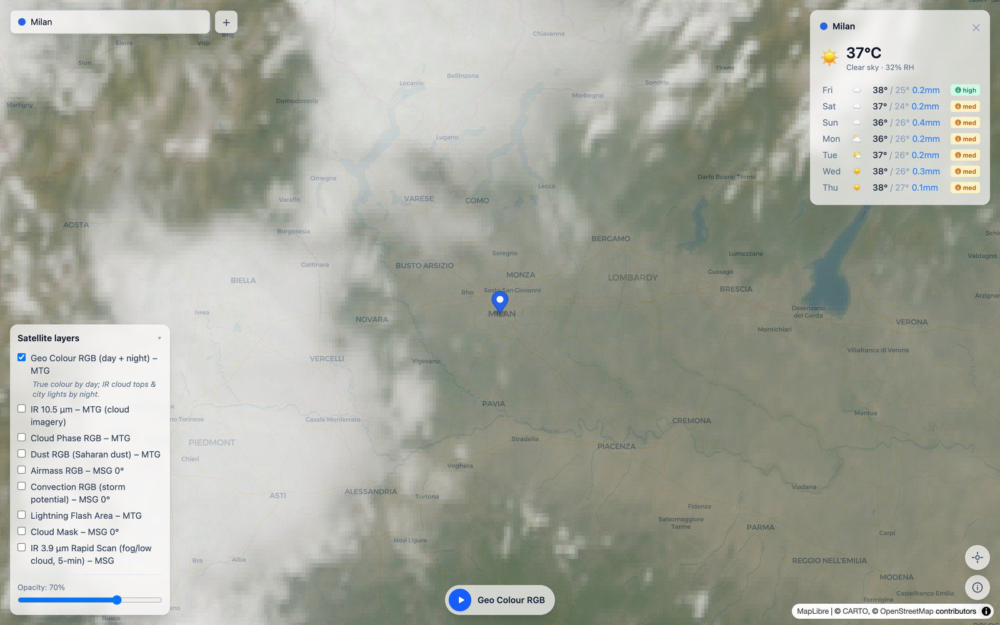
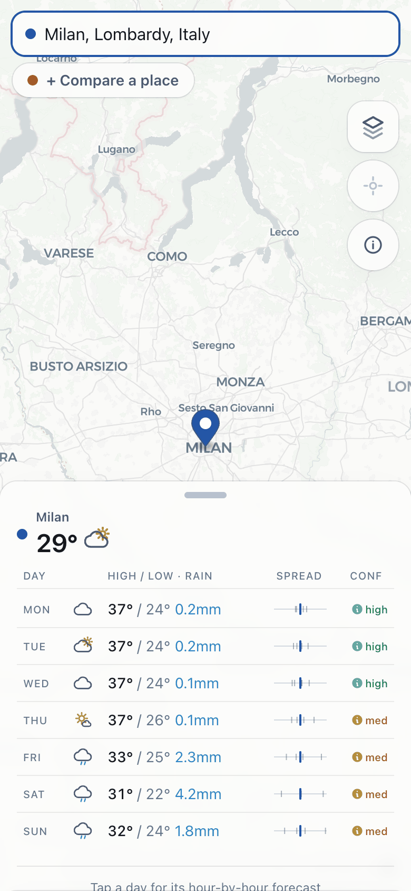

# meteo-aggregator-ui

A map-driven weather UI for the [meteo-aggregator-api](../meteo-aggregator-api) backend.
A full-screen MapLibre GL map: click (or search, or click a place label) to select
a location and see the aggregated multi-model forecast; `Shift`+click adds a second
location for side-by-side comparison; tap a day in the forecast to open its
hour-by-hour breakdown in a bottom sheet (temperature, precipitation, weather
icons; hover/tap a point for its exact value), with both locations overlaid on
one chart when two are selected; tap a day's confidence tag instead to see the
per-model temperatures, their blend weights, and how that confidence was
computed; toggleable EUMETSAT satellite WMS overlays. On load it starts at your location (browser
geolocation, else a configured default), and a locate button returns you there at any time. If
your browser has location blocked it says so rather than failing silently. An info button opens
a "how it works" page covering the data sources, the aggregation/weighting algorithm, and the
layers.

<p>
  
  
</p>

Pure frontend (Vite + React 19 + TypeScript + Tailwind v4 + MapLibre GL), reading
from the FastAPI backend over HTTP. See [`CLAUDE.md`](CLAUDE.md) for architecture
and the backend contract.

**Live:** <https://meteo-aggregator.pages.dev>

> A demo on free-tier infrastructure, capped to a single backend instance. It may
> be slow to wake, and it will not hold up under load. It also draws on Open-Meteo's
> free non-commercial tier. For anything real, deploy your own: the backend is one
> `gcloud run deploy` ([meteo-aggregator-api](https://github.com/pls78/meteo-aggregator-api)),
> and this UI points at it via a single secret (see [Deploy](#deploy)).

## Node version

The toolchain (Vite 8) requires **Node ≥ 20.19**, so use **Node 22** (`.nvmrc` pins
`22.22.1`). The shell often defaults to Node 18, which breaks the build, so run
`nvm use` first.

## Develop

```bash
nvm use            # Node 22
npm install
npm run dev        # http://localhost:5173
```

The UI needs the backend running for data. In dev, Vite proxies `/api` to it
(same-origin, so no backend CORS is needed):

```bash
cd ../meteo-aggregator-api && uvicorn api.main:app --reload   # http://localhost:8000
```

Other scripts: `npm run build` (typecheck + production build), `npm run lint`
(oxlint), `npm run preview` (serve the production build).

## API target: local vs. deployed

Which backend the UI calls is selected by Vite's mode-based env files, so the two
never collide:

| Command | Mode | API target | Mechanism |
|---------|------|-----------|-----------|
| `npm run dev` | development | **local** `:8000` | `.env` (`VITE_API_BASE_URL=/api`) → Vite dev proxy |
| `npm run build` | production | **your backend, via the Pages proxy** | `.env.production` (`/api`) → `functions/api/` |

Both modes call `/api` on the page's own origin. In dev, Vite's `server.proxy`
forwards it; in production, the Cloudflare Pages Function in
[`functions/api/`](functions/api/) does. The browser never talks cross-origin, so
**CORS is never involved and no backend URL is in the bundle**.

**You must deploy the backend yourself** ([`meteo-aggregator-api`](https://github.com/pls78/meteo-aggregator-api),
one `gcloud run deploy`) and give its URL to the Pages project as a secret:

```bash
npx wrangler pages secret put API_ORIGIN --project-name=<your-project>
```

The proxy caches responses at the edge (5 min), so repeat queries never reach
your backend. See [`.env.example`](.env.example).

Satellite tiles and legends follow the same pattern on a `/wms` route (Vite proxy
in dev, [`functions/wms.js`](functions/wms.js) in production, upstream fixed to
EUMETSAT's WMS). This one is load-bearing, not just tidy: EUMETSAT serves GetMap
images without CORS headers, and MapLibre fetches tiles in CORS mode, so direct
cross-origin tile fetches are blocked by the browser. Timestamped tiles are
immutable and cache at the edge for 7 days.

## Deploy

The build is fully static; it's hosted on **Cloudflare Pages** (direct upload, no
Git integration required):

```bash
nvm use
npm run build
npx wrangler pages deploy dist --project-name=meteo-aggregator  # -> https://meteo-aggregator.pages.dev
```

`wrangler` uploads `functions/` alongside `dist/`, so the proxy ships with the
site. Set the backend URL once per environment:

```bash
npx wrangler pages secret put API_ORIGIN --project-name=meteo-aggregator
npx wrangler pages secret put API_ORIGIN --project-name=meteo-aggregator --env preview
```

Without it, `/api/*` returns 503. Per-deploy `<hash>.meteo-aggregator.pages.dev`
aliases work fully, because every call is same-origin and no allow-list is involved.

## License

MIT, see [`LICENSE`](LICENSE).

That covers this code only. Forecasts and place search come from
[Open-Meteo](https://open-meteo.com) (data under CC-BY-4.0, free for
non-commercial use) via the backend. The map tiles and satellite layers carry
their own terms: [EUMETSAT](https://view.eumetsat.int) for the imagery, and
[CARTO](https://carto.com/basemaps/) Positron, built on OpenStreetMap data, for
the basemap. The in-app "how it works" dialog credits the weather and imagery
sources; basemap attribution is rendered by MapLibre from the CARTO style.
